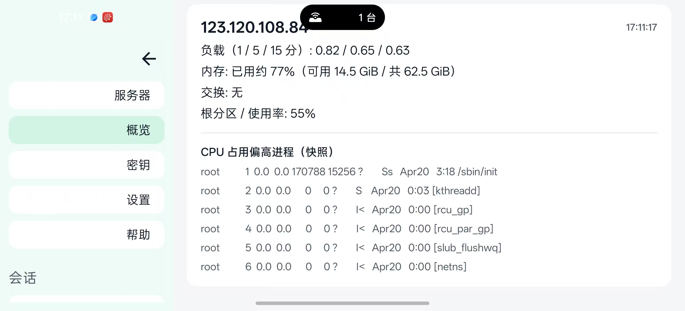
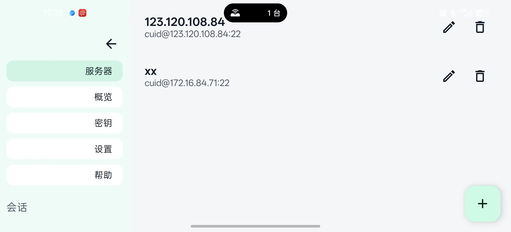
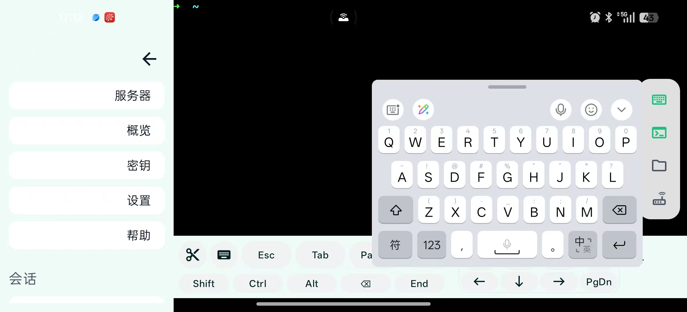
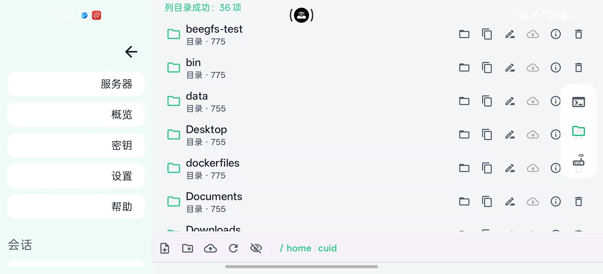
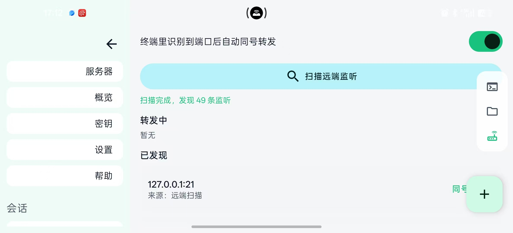
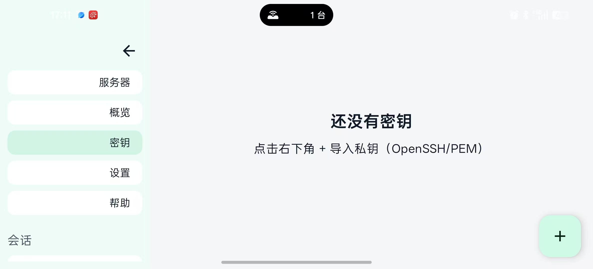
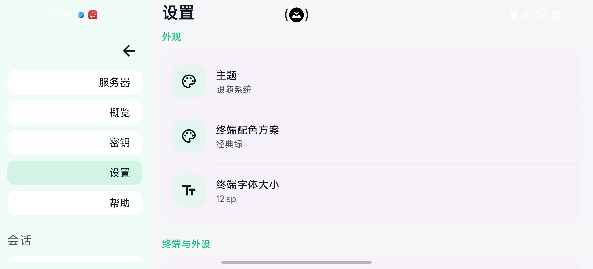
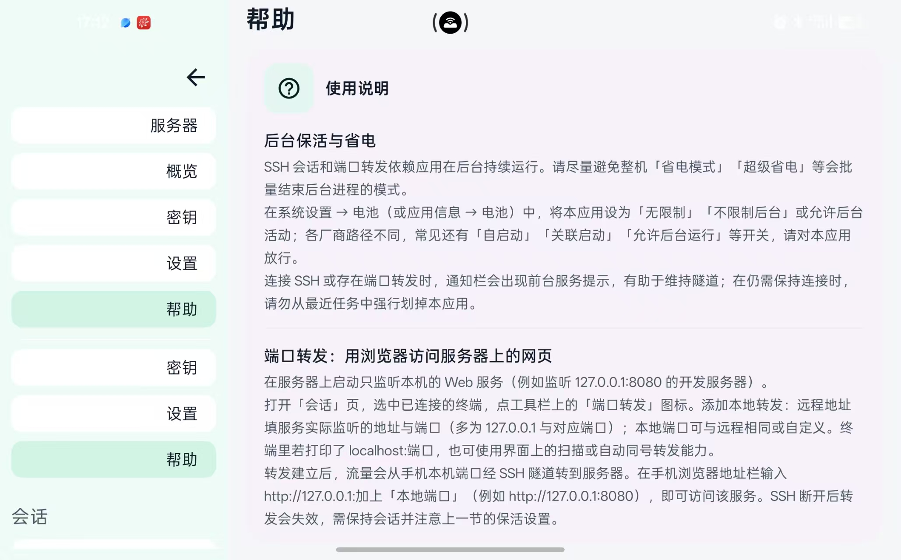

---
# Pandoc 生成 PDF（xelatex）时，将图/表题注由英文 “Figure/Table” 改为中文
lang: zh-CN
header-includes: |
  \AtBeginDocument{%
    \renewcommand{\figurename}{图}%
    \renewcommand{\tablename}{表}%
  }
---

# APP使用说明

**myshell（MyShell）**

## 一、引言

本说明旨在为「myshell」移动应用软件（以下简称「本软件」）提供功能介绍与使用指引。通过本说明，您可以了解本软件的主要能力、基本操作步骤、运行环境要求及相关注意事项。

## 二、软件概述

myshell 是一款面向需要在手机或平板上管理远程 Linux/Unix 服务器与执行命令行操作的用户而设计的 **SSH 终端类** 应用软件。本软件支持保存多台服务器连接信息、建立安全 Shell 会话、管理 SSH 密钥，并提供远程文件（SFTP）等能力，便于在移动场景下完成运维与开发相关的终端操作。

## 三、主要功能

1. **服务器管理：** 可添加、编辑、删除主机配置（地址、端口、用户名、认证方式等），在列表中快速选择目标主机并发起连接。
2. **终端会话：** 基于 SSH 建立交互式 Shell 会话，支持多会话并行；可在「会话」页切换、查看和管理当前打开的终端。
3. **远程文件：** 在已连接主机上浏览与管理远程目录与文件（具体能力以软件内界面为准），便于上传、下载或简单编辑等操作。
4. **SSH 密钥：** 在「密钥」页管理本地密钥材料，用于与服务器配置的公钥认证等方式配合使用。
5. **端口转发：** 支持基于 SSH 的端口转发相关能力（具体规则与入口以软件内为准），便于访问内网服务或保持转发会话。
6. **概览：** 在「概览」页查看与当前使用相关的汇总信息（以软件实际展示为准）。
7. **个性化设置：** 支持主题（浅色/深色/跟随系统）、终端配色方案、字体大小、选中自动复制等选项，可在「设置」中调整。
8. **帮助：** 提供「帮助」入口，便于查阅内置说明或指引。

## 四、使用步骤

### 1. 获取与安装

从您常用的 Android 应用分发渠道获取本软件的安装包（APK）或安装入口，按系统提示完成安装。首次打开时，系统可能会请求网络、通知等相关权限，请按实际需要授权，以保证连接与后台转发等功能可用。

### 2. 概览与主导航

启动本软件后，左侧为主要功能导航，通常包括 **服务器、会话、概览、密钥、设置、帮助** 等标签页。默认可从「服务器」页开始配置主机。本软件界面以 **横屏** 方式使用体验更佳（具体以设备与系统显示为准）。「概览」页可集中查看与当前使用相关的汇总信息。

### 3. 服务器管理

进入「服务器」页，通过添加/新建入口填写主机别名、主机名或 IP、端口（一般为 22）、用户名以及密码或密钥等认证信息，保存后即可在列表中看到该主机。需要修改时，可选择对应主机进入编辑界面更新配置。

### 4. 终端会话

在服务器列表中选择目标主机并发起连接，系统将建立 SSH 会话并进入终端界面。您可在终端中输入命令；若打开多个会话，可在「会话」页切换不同会话窗口。连接异常时，界面会给出相应状态或错误提示，请检查网络、端口、账号与密钥是否正确。

### 5. 远程文件

在软件提供的文件或 SFTP 相关入口中，选择已配置的主机并连接后，可浏览远程路径、进行上传下载或文件操作（以当前版本菜单为准）。

### 6. 端口转发

在会话建立后，可按软件内入口配置本地/远程端口转发，以便访问内网服务或临时映射端口（具体规则与字段以界面为准）。

### 7. 密钥管理

在「密钥」页生成、导入或管理 SSH 私钥/公钥信息，并在主机配置中与对应密钥关联，以实现免密或更安全登录（具体步骤与字段说明以编辑主机页面为准）。

### 8. 设置

进入「设置」，可按习惯切换 **主题**、**终端配色**、**字体大小**、**选中复制** 等选项，以获得更舒适的阅读和操作体验。

### 9. 帮助

在「帮助」页可查阅内置说明或指引；遇到问题时也可先在此查找常见说明。

## 五、系统要求

1. **操作系统：** Android（建议较新版本系统以获得更好的权限与前台服务兼容性）；本软件面向 **手机 / 平板** 等 Android 设备。
2. **系统版本：** 最低支持版本以发布包配置为准（当前工程通常为 **API 26 / Android 8.0** 及以上，发行版本如有调整以安装提示为准）。
3. **网络：** SSH 与远程操作依赖网络访问；请在设备已连接 Wi‑Fi 或移动数据且目标主机可达的前提下使用。
4. **存储与内存：** 占用空间相对较小；若进行大量文件传输，请保证设备剩余存储空间充足。
5. **权限说明：** 网络访问用于 SSH/SFTP；通知与前台服务类权限可能用于保持端口转发或后台任务时的系统要求（以实际权限申请说明为准）。

## 六、常见问题与解决方案

| 现象 | 可能原因 | 建议处理 |
|------|----------|----------|
| 无法连接服务器 | 网络不通、防火墙拦截、端口错误、主机下线 | 检查本机网络与服务器 `sshd` 是否监听；核对 IP/端口/用户名 |
| 认证失败 | 密码错误、未配置或未关联密钥 | 在主机配置中核对密码或绑定正确密钥 |
| 会话频繁断开 | 网络不稳定、省电策略限制后台 | 切换稳定网络；在系统设置中为本软件放宽后台限制 |
| 界面显示异常 | 系统版本或分辨率差异 | 更新系统或尝试旋转屏幕；在「设置」中调整主题与字体 |

> 若问题仍未解决，请通过应用内「帮助」或您获取软件时的支持渠道反馈，并尽量附带系统版本、软件版本与复现步骤。

---

*文档版本：V1.0（与产品迭代可能不完全同步，以软件内实际功能为准。）*
